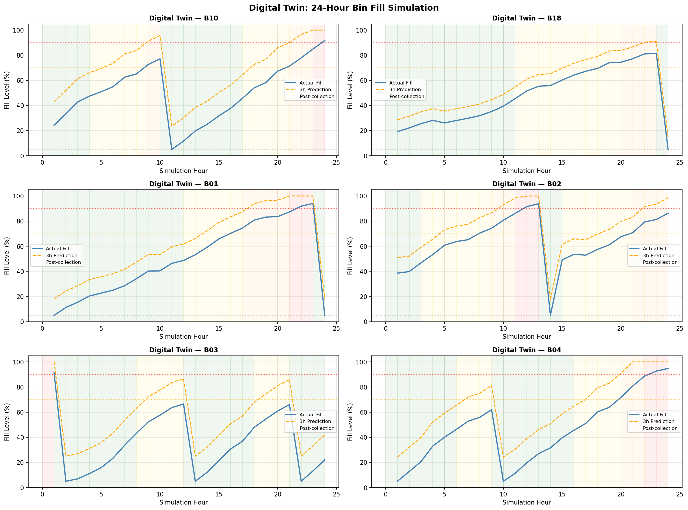
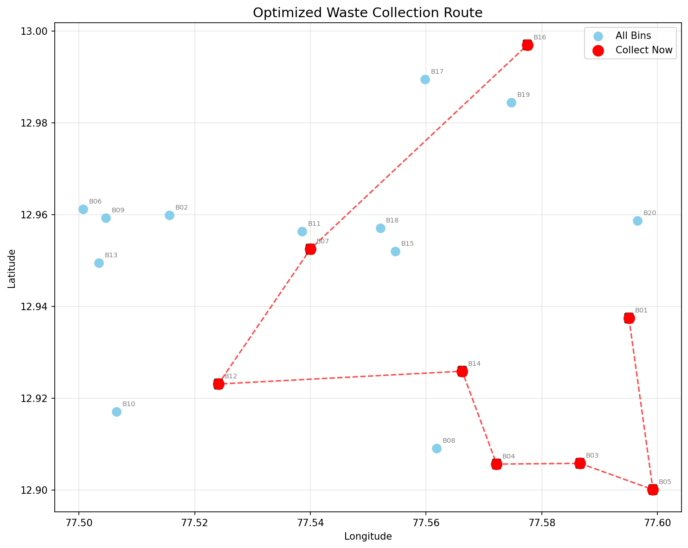
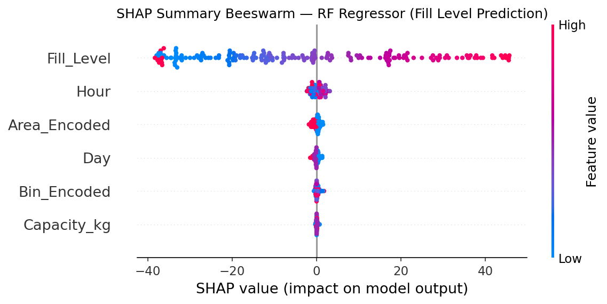
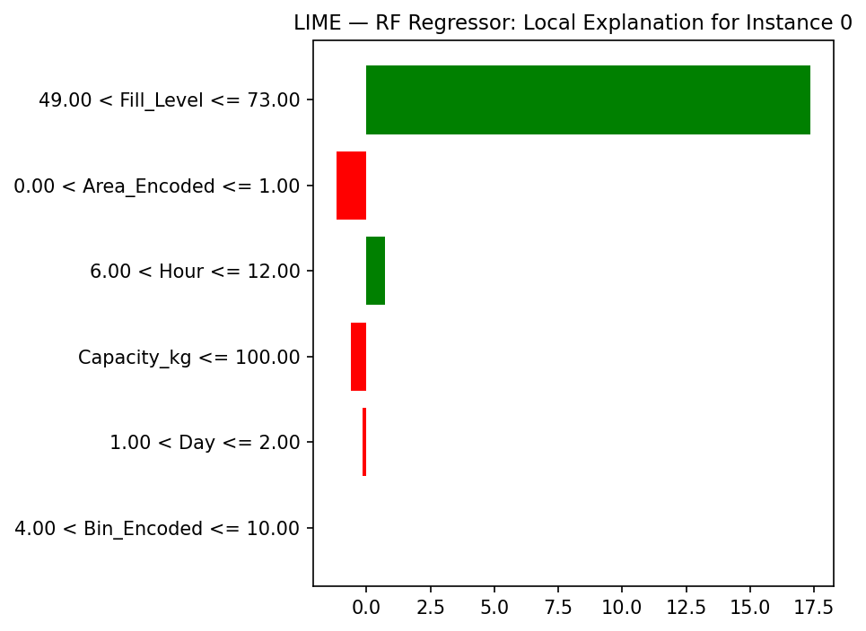

Smart Waste Management System
 AI • Optimization • Digital Twin • Simulation
 Overview
This project focuses on building an intelligent waste management system by combining machine learning, route optimization, and simulation. Instead of reacting to overflowing bins, the system predicts bin fill levels in advance and helps optimize collection operations.

A Random Forest model is used to estimate fill levels based on historical and contextual data, enabling proactive decision-making. The system also integrates route optimization techniques to minimize travel distance for collection vehicles.

To simulate real-world behavior, a Digital Twin framework is implemented, allowing monitoring of bin states, detection of overflows, and analysis of system performance over time. SimPy is used to model waste collection as a discrete-event system, making the simulation realistic and dynamic.

 Key Features
    Predictive analysis of bin fill levels using machine learning
  
    Optimized waste collection routing
  
    Digital Twin for real-time system modeling
  
    Simulation using SimPy
  
    Interactive visualizations (maps, dashboards)
  
    Explainable AI using SHAP and LIME

 Project Structure
Bash

smart-waste-management/
│
├── Smart_Waste_Management.ipynb
├── requirements.txt
├── README.md
│
├── data/
│   ├── waste_management_dataset.csv
│   ├── Smart_Bin.csv
│
├── images/
│   ├── digital_twin_dashboard.png
│   ├── optimized_route.png
│   ├── shap_rf_summary.png
│   ├── lime_rf_instance.png
│   ├── sim_truck_dashboard.png
│
├── outputs/
│   ├── sim_bin_summary.xlsx
│   ├── sim_event_log.xlsx
│   ├── sim_collections.xlsx
 Simulation Outputs
The system generates structured outputs including:

Bin-level summary statistics

Event logs capturing system behavior

Collection scheduling data

Performance insights from simulation

 Project Preview
Markdown

 Installation
Bash

pip install -r requirements.txt
 Usage
Run the notebook:

Bash

jupyter notebook Smart_Waste_Management.ipynb
 Final Note
This project combines prediction, optimization, and simulation into a unified system, making it closer to a real-world smart city solution rather than just a standalone machine learning model.

 Author
Nabeela Javed
B.Tech AI
